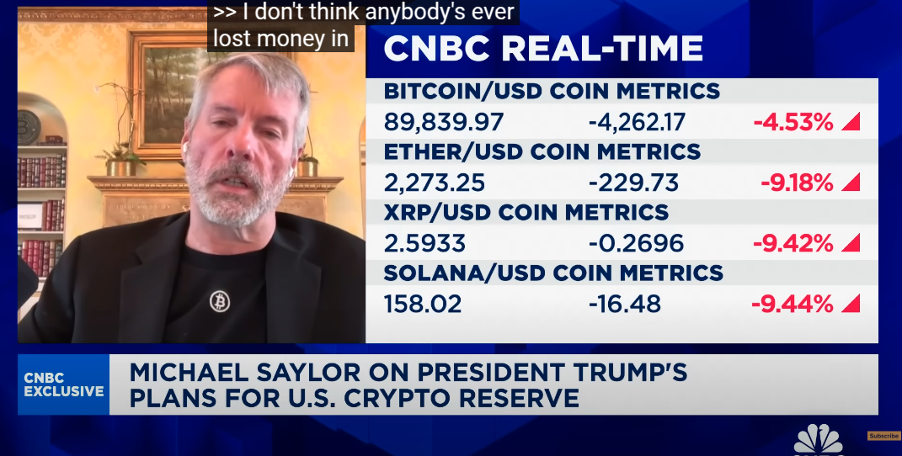

# Bitcoin Drawdowns / BTC-USD Timeseries

Inspired by Michael Saylor's 2025-03-03 CNBC interview where [he said](https://youtu.be/On8QX5_IoY0?si=FstwuWWviGVWmf1o&t=276): “I don't think anybody’s ever lost money in the Bitcoin network holding four years.”

[](https://youtu.be/On8QX5_IoY0?si=FstwuWWviGVWmf1o&t=276)

I downloaded daily BTC-USD price data from https://www.investing.com/crypto/bitcoin/historical-data, which seemed to have an undocumented 5,000-row limit (so multiple exports were required) and did not offer data prior to 2010-07-18 (which may have been insignificant for our purposes here anyway).

I first combined the CSV batches to one longer timeseries in [my Google Drive](https://docs.google.com/spreadsheets/d/1hgllgBl7-htTij1jq2m4qgitty4-z-B4Cx6dhuVaFs8/edit?gid=1957164531#gid=1957164531).

From there I exported it to [src/BTC-USD_daily.csv](src/BTC-USD_daily.csv).

## To run the script:

`npx tsx src/index.ts --verbose`

or

`npx tsx src/index.ts`

## Result (as of 2025-03-04):

```
Drawdown #1: 2010-11-07 🡺 2010-11-08 🡺 2011-01-13. 68 days (0.2 years). $0.30 🡺 $0.20
Drawdown #2: 2011-01-17 🡺 2011-01-17 🡺 2011-01-19. 3 days. $0.30 🡺 $0.30
Drawdown #3: 2011-02-10 🡺 2011-02-10 🡺 2011-02-10. 1 days. $1.00 🡺 $1.00
Drawdown #4: 2011-02-13 🡺 2011-02-13 🡺 2011-02-13. 1 days. $1.00 🡺 $1.00
Drawdown #5: 2011-02-15 🡺 2011-03-20 🡺 2011-04-16. 61 days (0.2 years). $1.00 🡺 $0.70
Drawdown #6: 2011-04-20 🡺 2011-04-20 🡺 2011-04-20. 1 days. $1.10 🡺 $1.10
Drawdown #7: 2011-04-24 🡺 2011-04-24 🡺 2011-04-25. 2 days. $1.60 🡺 $1.60
Drawdown #8: 2011-05-01 🡺 2011-05-01 🡺 2011-05-05. 5 days. $3.00 🡺 $3.00
Drawdown #9: 2011-05-09 🡺 2011-05-09 🡺 2011-05-09. 1 days. $3.80 🡺 $3.80
Drawdown #10: 2011-05-11 🡺 2011-05-11 🡺 2011-05-11. 1 days. $5.50 🡺 $5.50
Drawdown #11: 2011-05-14 🡺 2011-05-20 🡺 2011-05-24. 11 days. $7.20 🡺 $5.60
Drawdown #12: 2011-05-27 🡺 2011-05-28 🡺 2011-05-29. 3 days. $8.50 🡺 $8.30
Drawdown #13: 2011-05-31 🡺 2011-05-31 🡺 2011-05-31. 1 days. $8.70 🡺 $8.70
Drawdown #14: 2011-06-05 🡺 2011-06-05 🡺 2011-06-06. 2 days. $16.70 🡺 $16.70
Drawdown #15: 2011-06-09 🡺 2011-11-18 🡺 2013-02-19. 622 days (1.7 years). $28.90 🡺 $2.00
Drawdown #16: 2013-02-23 🡺 2013-02-23 🡺 2013-02-24. 2 days. $29.80 🡺 $29.80
Drawdown #17: 2013-02-27 🡺 2013-02-27 🡺 2013-02-27. 1 days. $30.90 🡺 $30.90
Drawdown #18: 2013-03-02 🡺 2013-03-02 🡺 2013-03-02. 1 days. $34.30 🡺 $34.30
Drawdown #19: 2013-03-10 🡺 2013-03-10 🡺 2013-03-10. 1 days. $46.00 🡺 $46.00
Drawdown #20: 2013-03-12 🡺 2013-03-12 🡺 2013-03-17. 6 days. $44.30 🡺 $44.30
Drawdown #21: 2013-03-22 🡺 2013-03-23 🡺 2013-03-23. 2 days. $69.90 🡺 $64.30
Drawdown #22: 2013-03-28 🡺 2013-03-28 🡺 2013-03-28. 1 days. $86.20 🡺 $86.20
Drawdown #23: 2013-04-04 🡺 2013-04-04 🡺 2013-04-04. 1 days. $132.10 🡺 $132.10
Drawdown #24: 2013-04-10 🡺 2013-04-16 🡺 2013-11-03. 208 days (0.6 years). $165.00 🡺 $68.40
Drawdown #25: 2013-11-10 🡺 2013-11-10 🡺 2013-11-11. 2 days. $336.30 🡺 $336.30
Drawdown #26: 2013-11-14 🡺 2013-11-14 🡺 2013-11-15. 2 days. $433.40 🡺 $433.40
Drawdown #27: 2013-11-19 🡺 2013-11-20 🡺 2013-11-21. 3 days. $645.70 🡺 $638.00
Drawdown #28: 2013-11-24 🡺 2013-11-24 🡺 2013-11-25. 2 days. $795.00 🡺 $795.00
Drawdown #29: 2013-11-30 🡺 2013-12-01 🡺 2013-12-03. 4 days. $1,205.70 🡺 $1,004.40
Drawdown #30: 2013-12-05 🡺 2014-02-21 🡺 2017-03-01. 1,183 days (3.2 years). $1,106.30 🡺 $111.60
Drawdown #31: 2017-03-04 🡺 2017-03-24 🡺 2017-04-25. 53 days (0.1 years). $1,264.30 🡺 $939.70
Drawdown #32: 2017-04-28 🡺 2017-04-28 🡺 2017-04-28. 1 days. $1,329.60 🡺 $1,329.60
Drawdown #33: 2017-05-05 🡺 2017-05-05 🡺 2017-05-05. 1 days. $1,507.80 🡺 $1,507.80
Drawdown #34: 2017-05-12 🡺 2017-05-12 🡺 2017-05-17. 6 days. $1,686.40 🡺 $1,686.40
Drawdown #35: 2017-05-25 🡺 2017-05-27 🡺 2017-06-01. 8 days. $2,307.20 🡺 $2,052.40
Drawdown #36: 2017-06-04 🡺 2017-06-04 🡺 2017-06-04. 1 days. $2,524.10 🡺 $2,524.10
Drawdown #37: 2017-06-07 🡺 2017-06-07 🡺 2017-06-09. 3 days. $2,691.50 🡺 $2,691.50
Drawdown #38: 2017-06-12 🡺 2017-07-16 🡺 2017-08-04. 54 days (0.1 years). $2,656.80 🡺 $1,914.10
Drawdown #39: 2017-08-06 🡺 2017-08-06 🡺 2017-08-06. 1 days. $3,232.00 🡺 $3,232.00
Drawdown #40: 2017-08-09 🡺 2017-08-09 🡺 2017-08-10. 2 days. $3,348.80 🡺 $3,348.80
Drawdown #41: 2017-08-15 🡺 2017-08-15 🡺 2017-08-15. 1 days. $4,161.70 🡺 $4,161.70
Drawdown #42: 2017-08-17 🡺 2017-08-21 🡺 2017-08-27. 11 days. $4,278.90 🡺 $4,005.10
Drawdown #43: 2017-08-30 🡺 2017-08-30 🡺 2017-08-30. 1 days. $4,583.00 🡺 $4,583.00
Drawdown #44: 2017-09-02 🡺 2017-09-14 🡺 2017-10-11. 40 days (0.1 years). $4,573.80 🡺 $3,243.10
Drawdown #45: 2017-10-15 🡺 2017-10-18 🡺 2017-10-19. 5 days. $5,688.10 🡺 $5,575.80
Drawdown #46: 2017-10-22 🡺 2017-10-24 🡺 2017-10-28. 7 days. $5,982.90 🡺 $5,513.10
Drawdown #47: 2017-10-30 🡺 2017-10-30 🡺 2017-10-30. 1 days. $6,124.30 🡺 $6,124.30
Drawdown #48: 2017-11-06 🡺 2017-11-06 🡺 2017-11-07. 2 days. $6,959.20 🡺 $6,959.20
Drawdown #49: 2017-11-09 🡺 2017-11-12 🡺 2017-11-15. 7 days. $7,129.60 🡺 $5,878.10
Drawdown #50: 2017-11-17 🡺 2017-11-17 🡺 2017-11-18. 2 days. $7,700.00 🡺 $7,700.00
Drawdown #51: 2017-11-21 🡺 2017-11-23 🡺 2017-11-24. 4 days. $8,100.00 🡺 $8,013.40
Drawdown #52: 2017-11-29 🡺 2017-11-29 🡺 2017-11-29. 1 days. $9,837.90 🡺 $9,837.90
Drawdown #53: 2017-12-08 🡺 2017-12-09 🡺 2017-12-11. 4 days. $16,047.60 🡺 $14,843.40
Drawdown #54: 2017-12-13 🡺 2017-12-13 🡺 2017-12-14. 2 days. $16,286.80 🡺 $16,286.80
Drawdown #55: 2017-12-17 🡺 2018-12-15 🡺 2020-11-29. 1,079 days (3.0 years). $19,065.70 🡺 $3,228.70
Drawdown #56: 2020-12-01 🡺 2020-12-11 🡺 2020-12-15. 15 days. $18,770.70 🡺 $18,023.60
Drawdown #57: 2020-12-20 🡺 2020-12-21 🡺 2020-12-24. 5 days. $23,474.90 🡺 $22,728.50
Drawdown #58: 2020-12-27 🡺 2020-12-27 🡺 2020-12-27. 1 days. $26,261.30 🡺 $26,261.30
Drawdown #59: 2021-01-04 🡺 2021-01-04 🡺 2021-01-04. 1 days. $32,022.60 🡺 $32,022.60
Drawdown #60: 2021-01-09 🡺 2021-01-27 🡺 2021-02-07. 30 days. $40,151.90 🡺 $30,404.00
Drawdown #61: 2021-02-10 🡺 2021-02-10 🡺 2021-02-10. 1 days. $44,836.00 🡺 $44,836.00
Drawdown #62: 2021-02-12 🡺 2021-02-13 🡺 2021-02-13. 2 days. $47,371.70 🡺 $47,168.70
Drawdown #63: 2021-02-15 🡺 2021-02-15 🡺 2021-02-15. 1 days. $47,936.30 🡺 $47,936.30
Drawdown #64: 2021-02-18 🡺 2021-02-18 🡺 2021-02-18. 1 days. $51,582.20 🡺 $51,582.20
Drawdown #65: 2021-02-22 🡺 2021-02-28 🡺 2021-03-10. 17 days. $54,111.80 🡺 $45,164.00
Drawdown #66: 2021-03-12 🡺 2021-03-12 🡺 2021-03-12. 1 days. $57,265.10 🡺 $57,265.10
Drawdown #67: 2021-03-14 🡺 2021-03-25 🡺 2021-04-12. 30 days. $59,113.70 🡺 $51,322.30
Drawdown #68: 2021-04-14 🡺 2021-07-20 🡺 2021-10-18. 188 days (0.5 years). $62,980.40 🡺 $29,793.80
Drawdown #69: 2021-10-21 🡺 2021-10-27 🡺 2021-11-07. 18 days. $62,210.20 🡺 $58,438.10
Drawdown #70: 2021-11-09 🡺 2022-11-21 🡺 2024-03-03. 846 days (2.3 years). $66,904.40 🡺 $15,776.20
Drawdown #71: 2024-03-05 🡺 2024-03-05 🡺 2024-03-08. 4 days. $63,792.60 🡺 $63,792.60
Drawdown #72: 2024-03-12 🡺 2024-03-12 🡺 2024-03-12. 1 days. $71,470.20 🡺 $71,470.20
Drawdown #73: 2024-03-14 🡺 2024-09-06 🡺 2024-11-05. 237 days (0.6 years). $71,387.50 🡺 $53,966.80
Drawdown #74: 2024-11-12 🡺 2024-11-12 🡺 2024-11-12. 1 days. $87,941.30 🡺 $87,941.30
Drawdown #75: 2024-11-14 🡺 2024-11-14 🡺 2024-11-14. 1 days. $87,294.00 🡺 $87,294.00
Drawdown #76: 2024-11-16 🡺 2024-11-17 🡺 2024-11-18. 3 days. $90,539.10 🡺 $89,833.70
Drawdown #77: 2024-11-23 🡺 2024-11-26 🡺 2024-12-05. 13 days. $97,699.00 🡺 $91,977.60
Drawdown #78: 2024-12-09 🡺 2024-12-10 🡺 2024-12-10. 2 days. $97,359.40 🡺 $96,600.30
Drawdown #79: 2024-12-12 🡺 2024-12-12 🡺 2024-12-12. 1 days. $100,009.90 🡺 $100,009.90
Drawdown #80: 2024-12-14 🡺 2024-12-14 🡺 2024-12-14. 1 days. $101,417.70 🡺 $101,417.70
Drawdown #81: 2024-12-18 🡺 2025-01-09 🡺 2025-01-20. 34 days (0.1 years). $100,197.80 🡺 $92,539.80
Drawdown #82: 2025-01-22 🡺 2025-02-26 🡺 2025-03-03. 41 days (0.1 years). $103,684.80 🡺 $84,212.70
Longest drawdown: 2013-12-05 🡺 2014-02-21 🡺 2017-03-01. 1,183 days (3.2 years). $1,106.30 🡺 $111.60 {
  duration: 1183,
  end: 2017-03-01T00:00:00.000Z,
  peak: { date: 2013-12-05T00:00:00.000Z, price: 1106.3 },
  trough: { date: 2014-02-21T00:00:00.000Z, price: 111.6 }
}
```
